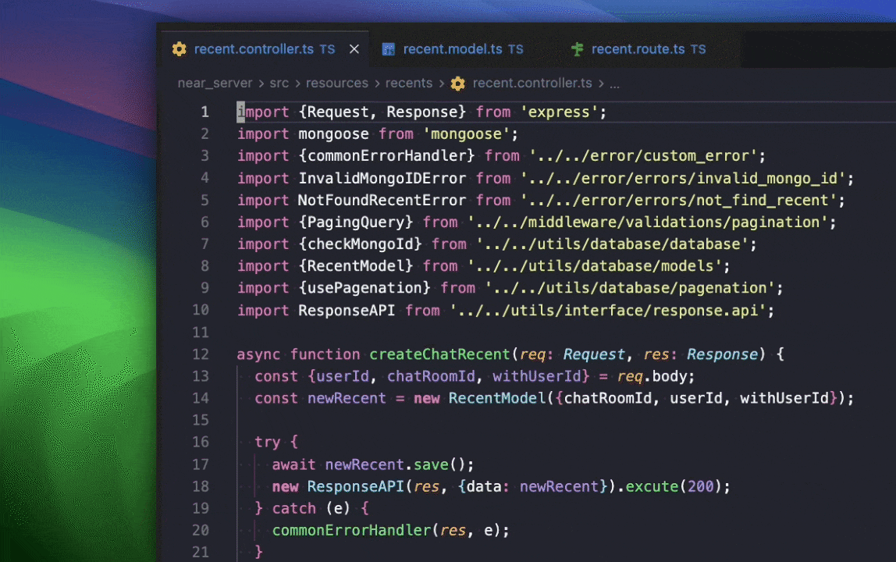

<p align="center">
  
</p>

# Auto Close Classified Tabs

使っていないタブを自動で閉じ、ファイルの種別ごとにタブの色を変える VS Code / Cursor 拡張です。
English: [README.md](README.md)

- 未保存のタブは**絶対に閉じません**
- 残すタブの数を設定できます(既定 3、エディタグループごと)
- ピン留めしたタブは自動クローズの対象外になります
- ファイル種別に応じてタブの文字色とバッジ(`TS` `PY` `DA` など)が変わります

<p align="center">
  
</p>

## 使い始める

```bash
npm install
npm run compile
```

VS Code でこのフォルダを開き `F5` を押すと、拡張機能ホストが起動して試せます。
実際にインストールする場合は `npm run package` を実行し、`vsix/` に出力される `.vsix` を入れてください。

### 最初に一度だけ: 色をタブにだけ表示する

VS Code はタブへの装飾表示に 2 つの設定を使います(古い版では既定で無効です)。
エクスプローラー側の装飾も併せて調整するため、初回起動時に案内が出ます。自分で実行しても構いません。

> **Auto Close Classified Tabs: タブにだけ種別の色を表示する**

```jsonc
"workbench.editor.decorations.colors": true,   // タブに色を出す
"workbench.editor.decorations.badges": true,   // タブにバッジを出す
"explorer.decorations.colors": false,          // エクスプローラーは素の表示にする
"explorer.decorations.badges": false
```

`explorer.decorations.*` はすべての装飾プロバイダーで共有されるスイッチのため、
無効にすると **Git や問題マーカーがエクスプローラーに出しているものも一緒に消えます** —
ファイル名の色と、右側に出る `M` / `U` やエラー件数のバッジです。
プロバイダー側からはタブとエクスプローラーを区別できないので、
エクスプローラーを素のままタブにだけ装飾を出す方法はこれしかありません。
Git のマーカーを優先したい場合は、どちらかを `true` に戻すか、次のコマンドを実行して
4 つの設定をまとめて削除し、VS Code の既定に戻してください。

> **Auto Close Classified Tabs: 色とバッジの表示を既定に戻す**

## 特定のタブを閉じたくないとき

タブを右クリック →「**自動クローズから保護(ピン留めの切替)**」。

VS Code 標準のピン留めを切り替えるだけなので、保護リストをどこかに保存する必要がありません。
標準の「ピン留め」メニューや `Ctrl/Cmd+K Shift+Enter` でも同じです。

## 設定

| 設定 | 既定値 | 説明 |
|---|---|---|
| `autoCloseClassifiedTabs.enabled` | `true` | 自動クローズの有効・無効 |
| `autoCloseClassifiedTabs.maxTabs` | `3` | エディタグループごとに残すタブの数 |
| `autoCloseClassifiedTabs.maxTabsByType` | `{"diff": 1}` | 種別ごとの上限。`maxTabs` より先に適用 |
| `autoCloseClassifiedTabs.closeOnStartup` | `true` | ウィンドウを開いた直後にタブを閉じる |
| `autoCloseClassifiedTabs.closePreviewFirst` | `true` | プレビュータブ(斜体)を先に閉じる |
| `autoCloseClassifiedTabs.colors.enabled` | `true` | 色分けとバッジの有効・無効 |
| `autoCloseClassifiedTabs.colors.rules` | `{}` | ファイルの種別を上書き |

### 復元したセッションを残す

タブを 20 枚復元したウィンドウは、表示のおよそ 150ms 後に `maxTabs` まで減ります。
`closeOnStartup` を `false` にすると復元したタブはそのまま残りますが、**次にタブを開いた
時点で通常どおり掃除されます**。恒久的な除外ではなく、残したいタブをピン留めするための
猶予だと考えてください。閉じられたタブは `Ctrl/Cmd+Shift+T` で戻せます。

### 種別ごとにタブ数を絞る

`maxTabsByType` は、その種別のタブを同時に何枚まで開いておけるかを決めます。
`maxTabs` より**先に**適用されます。差分エディタは既定で 1 枚に制限しています
(3 ファイル前に開いた差分を今も見たいことはまずないため)。

キーは下の表にある色の名前です。**ここに書かれていない種別は `maxTabs` だけが効く**ので、
実際に編集しているコードファイルが巻き込まれることはありません。

```jsonc
"autoCloseClassifiedTabs.maxTabsByType": {
  "diff": 1,        // 差分は 1 枚だけ
  "generated": 1,   // 自動生成物は開きっぱなしにしない
  "docs": 2,        // Markdown は 2 枚まで
  "json": 2
}
```

`0` を指定すると、その種別はタブから離れた時点ですべて閉じます。
未保存・ピン留め・アクティブなタブは変わらず閉じないので、それらで埋まっている場合は
上限を超えたままになります。

`colors.rules` のキーは、`/` を含めばパスの一部として、含まなければパスの末尾として照合します。

```jsonc
"autoCloseClassifiedTabs.colors.rules": {
  ".proto":   "sql",
  "docs/":    "docs",
  "src/api/": "typescript"
}
```

## 色

言語とファイル形式ごとに 1 色、全 26 色です。書式の違う設定ファイル
(`settings.json` と `pubspec.yaml`)は別の色になるので、同じ種類のファイルでもタブを見分けられます。

| 色 | 対象 |
|---|---|
| `diff` | 差分エディタ、Git 上のファイル |
| `test` | `*.test.*` `*_test.*` `*.spec.*`、`test/` 配下 |
| `generated` | `*.g.dart` `*.freezed.dart` `*.d.ts` `*.lock`、`node_modules/` |
| `docs` | `.md` `.txt` `.rst` `.pdf` `LICENSE` |
| `json` | `.json` `.jsonc` `.json5` |
| `yaml` | `.yaml` `.yml` |
| `toml` | `.toml` `.ini` `.properties` |
| `env` | `.env` |
| `sql` | `.sql` `.proto` `.graphql` |
| `shell` | `.sh` `.bash` `.zsh` `.ps1` `.lua` `.pl` `.r` |
| `docker` | `Dockerfile` `Makefile` |
| `typescript` | `.ts` `.tsx` `.mts` `.cts` |
| `javascript` | `.js` `.jsx` `.mjs` `.cjs` |
| `dart` | `.dart` |
| `python` | `.py` `.pyi` |
| `go` | `.go` |
| `rust` | `.rs` |
| `jvm` | `.java` `.kt` `.kts` `.scala` |
| `swift` | `.swift` `.m` `.mm` |
| `ruby` | `.rb` |
| `php` | `.php` |
| `cfamily` | `.c` `.h` `.cpp` `.hpp` `.zig` |
| `csharp` | `.cs` |
| `html` | `.html` `.vue` `.svelte` |
| `css` | `.css` `.scss` `.sass` `.less` |
| `xml` | `.xml` `.svg` |

ドットファイルは拡張子として解釈できないため、ファイル名で判定します。
`.gitignore` `.eslintignore` `.editorconfig` `.npmrc` は `toml`、
`.eslintrc` `.prettierrc` は `json`、`.env`(`.env.local` などの派生も含む)は `env` です。
`.eslintrc.json` のように実際の拡張子が付いている場合は、そちらの書式の色を優先します
(JSON なら黄緑、YAML ならミント)。

判定は 差分 → テスト → 自動生成 → 拡張子 の順です。自分で書いたルールが 1 つのファイルに
複数当たった場合は**キーが長い方**が勝つので、`settings.json` を並べ替えても色は変わりません。
`colors.rules` は**色だけ**を上書きし、
記号はそのまま残ります。

色はテーマカラーとして定義しているので、好きな色に変えられます。

```jsonc
"workbench.colorCustomizations": {
  "autoCloseClassifiedTabs.python": "#ff9900"
}
```

### バッジはタブには表示されません

`FileDecoration` のバッジ(`TS` `PY` `{}`)はエクスプローラーには出ますが、
**エディタのタブには出ません**。タブに描画されるのは装飾の色だけです。
色だけで足りない場合は、下の種別アイコンを使ってください。タブに記号を出す唯一の方法です。

## タブ名に種別アイコンを付ける(任意)

「**Auto Close Classified Tabs: タブ名に種別アイコンを付ける**」を実行すると、
`workbench.editor.customLabels.patterns` に絵文字付きのパターンを書き込みます。
`main.dart` が `🎯 main.dart` と表示され、色と合わせて種別が一目で分かります。
記号は拡張子ごとに違うので、色が近い `{} settings.json` と `📋 pubspec.yaml` も区別できます。
書き込まれるパターンは 42 件ほどで、ドットファイルも含みます。

「**タブ名から種別アイコンを取り除く**」は、この拡張が書き込んだパターンだけを消し、
自分で追加したものは残します。

## 保存されるデータについて

**何も保存しません。**

- `globalState` / `workspaceState` を使わない
- ファイルを書き出さない、ネットワークに接続しない、テレメトリも送らない
- ファイルの中身を読まない(パスの文字列だけを見ます)
- 実行時の依存パッケージがゼロ

タブの利用順はメモリ上にだけ持ち、ウィンドウを閉じれば消えます。
設定を書き込むのは「タブにだけ種別の色を表示する」と「タブ名に種別アイコンを付ける」を
実行したときだけで、どちらにも取り消すコマンド(「色とバッジの表示を既定に戻す」
「タブ名から種別アイコンを取り除く」)があります。

## 開発

```bash
npm run typecheck   # tsc --noEmit
npm test            # ユニットテスト(60 件、VS Code 不要)
npm run test:e2e    # 統合テスト(12 件、VS Code を起動)
npm run package     # vsix/auto-close-classified-tabs.vsix を作る
```

色とバッジが実際にタブへ描画されるかは、描画結果を読み取る API が無いためテストで検証できません。
目視で確認してください。

1. `F5` を押す
2. 「**タブにだけ種別の色を表示する**」を実行する
3. `.ts` `.py` `.md` を開き、ラベルの色とバッジが種別ごとに違うことを確認する

### アイコンを作り直す

元データは `media/icon.svg` で、マニフェストが参照しているのは `media/icon.png` です。
macOS なら追加のツールなしで変換できます。

```bash
sips -s format png -Z 128 media/icon.svg --out media/icon.png
```

`qlmanage` は使わないでください。角丸の外側の透過部分が白で塗り潰され、
暗い背景の上では四隅が白く見えてしまいます。

## リリース

1. `main` から `release/Ver_X.Y.Z` ブランチを作って push する
2. [release.yml](.github/workflows/release.yml) が型チェック・両方のテスト・VSIX の作成を行い、
   `Ver_X.Y.Z` タグの GitHub Release を作って VSIX を添付する
3. Secret に `OVSX_TOKEN` が登録されていれば Open VSX へも公開する。未登録ならその手順だけを
   警告付きでスキップし、他はそのまま実行される
4. `package.json` の version と切り出した `CHANGELOG.md` が `main` へコミットされる

補足:

- **CHANGELOG の項目を手で移動しないでください。** `[Unreleased]` の下に書けば、リリース時に
  [`scripts/release-changelog.js`](scripts/release-changelog.js) が `## [X.Y.Z] — 日付` へ移します。
  拡張機能の公開ページが表示するのは **VSIX に同梱された `CHANGELOG.md`** なので、切り出しは
  パッケージより前に行われます(後から `main` だけ直しても公開ページは Unreleased のままです)。
  同じ節がそのままリリースノートになります
- **CHANGELOG は英語で書きます。** 公開ページは誰が読んでも同じ内容になるためです。
  `scripts/release-changelog.test.js` が、英語であること・Keep a Changelog の節名・
  公開中の版の見出しがあることを検査します
- `[Unreleased]` が空のままリリースするとバージョン見出しは作られず、リリースノートは
  コミットログから生成されます
- `Ver_X.Y.Z` が既にある場合は `Ver_X.Y.Z+1` として採番されます(公開済みリリースは不変)。
  Open VSX は同じ version を重複として弾くため、`+N` の再ビルドは GitHub Release だけになります
- 既存の最新タグより古いバージョンは拒否されます。Open VSX は公開の取り消しができないためです
- Open VSX の名前空間は初回のみ手動で作ります:
  `npx ovsx create-namespace yuuki-sakai -p <token>`
- `ci.yml` は `release/**` では走らないので、公開前のゲートは `release.yml` だけです

## ライセンス

MIT
